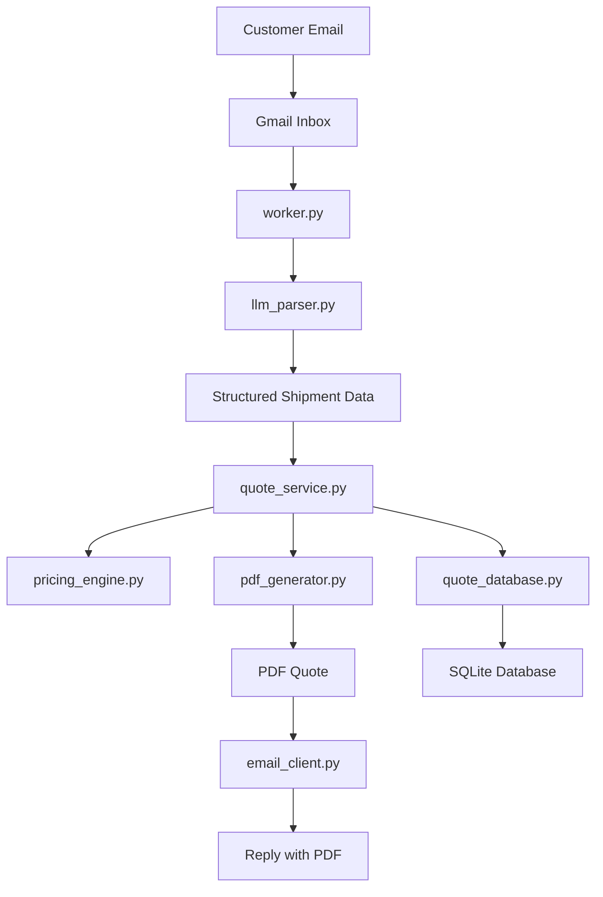

# Cargo Quote Assistant

Cargo Quote Assistant is an email-driven freight quoting prototype that monitors a Gmail inbox, identifies quote requests, extracts shipment details with Gemini, generates pricing, creates a PDF quote, stores the result in SQLite, and replies to the sender by email.

It is designed for fast iteration, local testing, and internal demos of an automated email-to-quote workflow.

## Overview

The system follows a simple end-to-end flow:

1. A customer sends a freight quote request by email.
2. The worker polls Gmail for unread messages.
3. The message is classified as a quote request or ignored.
4. Gemini extracts structured shipment details.
5. The pricing engine calculates a quote.
6. A PDF quote is generated.
7. The quote is saved to SQLite.
8. The system replies with the quote attached.

## Features

- Gmail inbox polling for unread messages
- Freight quote classification
- Shipment extraction with Gemini
- Local quote generation through shared Python logic
- PDF quote generation with ReportLab
- Quote storage in SQLite
- Clarification replies for incomplete shipment requests
- Processed-email tracking to avoid duplicate handling
- Optional FastAPI quote endpoint

## Quick Start

### 1. Create and activate a virtual environment

```bash
python3 -m venv .venv
source .venv/bin/activate
python -m pip install --upgrade pip
pip install -r requirements.txt
```

### 2. Add your Gemini API key

Create a `.env` file in the project root:

```env
GEMINI_API_KEY=your_api_key_here
```

### 3. Add Gmail OAuth credentials

Place your Google OAuth desktop credentials file in the project root as:

```text
credentials.json
```

### 4. Start the agent

```bash
python3 agent_runner.py
```

On first run, a browser window should open for Gmail OAuth. Sign in with the Gmail account the bot should monitor.

### 5. Send a test email

Send a quote request from a different email account to the monitored Gmail inbox, then wait for the next polling cycle.

## Architecture



## Project Structure

### Core workflow

- `agent_runner.py`
  Runs the email-processing loop on a fixed interval.

- `worker.py`
  Main orchestration layer for email retrieval, classification, extraction, quote generation, PDF creation, storage, and reply sending.

- `llm_parser.py`
  Gemini integration for email classification and shipment extraction.

- `quote_service.py`
  Shared quote-generation logic used by both the worker and the API.

- `pricing_engine.py`
  Distance estimation, pricing rules, accessorials, transit time, and equipment selection.

### Supporting modules

- `email_client.py`
  Gmail authentication, inbox access, message replies, and message state updates.

- `pdf_generator.py`
  PDF quote rendering.

- `quote_database.py`
  SQLite quote storage.

- `query_database.py`
  CLI utility for inspecting saved quotes and database stats.

- `last_run_tracker.py`
  Tracks processed email IDs and last-run metadata.

- `logging_setup.py`
  Rotating file logging configuration.

- `quote_api.py`
  Optional FastAPI wrapper around the shared quote logic.

## Requirements

- Python 3.12 recommended
- A Gmail account for the bot to monitor
- Google OAuth desktop app credentials
- A Gemini API key

Dependencies are listed in `requirements.txt`.

## Setup

### Python environment

```bash
python3 -m venv .venv
source .venv/bin/activate
python -m pip install --upgrade pip
pip install -r requirements.txt
```

### Environment configuration

Create `.env`:

```env
GEMINI_API_KEY=your_api_key_here
```

### Gmail OAuth

Place your Google OAuth desktop credentials in:

```text
credentials.json
```

After a successful login, the app will create:

```text
token.json
```

If `token.json` becomes invalid or revoked, the app falls back to a fresh OAuth flow automatically.

## Running the Agent

Start the worker:

```bash
python3 agent_runner.py
```

Each polling cycle:

1. Reads unread Gmail messages
2. Classifies likely quote requests
3. Extracts shipment details
4. Generates pricing
5. Creates PDFs
6. Saves quotes to SQLite
7. Replies by email

Current polling interval:

- 60 seconds

## Workflow Details

### 1. Email retrieval

Unread inbox emails are retrieved from Gmail.

The worker currently processes up to 25 unread messages per cycle.

### 2. Email classification

The system first uses heuristics to detect likely freight quote requests.

If the heuristics are ambiguous, Gemini is asked to classify the email as:

- `QUOTE`
- `NOT_QUOTE`

Non-quote emails are marked complete so they do not keep resurfacing forever.

### 3. Shipment extraction

For quote-request emails, Gemini is prompted to return structured JSON containing:

- origin
- destination
- cargo details
- special services
- pickup date
- additional notes

The parser also:

- normalizes numeric fields
- defaults missing `pieces` to `1` when weight is present
- retries once with a stricter compact-output prompt if Gemini returns malformed or truncated JSON

### 4. Quote generation

Quote generation happens locally through `quote_service.py`.

The pricing logic includes:

- base rate
- fuel surcharge
- liftgate fee
- climate control fee
- residential delivery fee
- insurance
- other accessorials
- transit days
- equipment selection

### 5. PDF generation

Generated PDFs are written to the `quotes/` folder.

Each PDF includes:

- quote ID
- shipment lane
- equipment type
- transit time
- cost breakdown
- total cost
- quote terms

### 6. Database storage

Quotes are stored in `quotes.db`.

Stored data includes:

- quote ID
- customer email and name
- origin and destination
- cargo details
- total cost
- transit time
- quote payload
- PDF path
- original email body

### 7. Reply handling

When quote generation succeeds, the system replies in-thread with:

- a short lane summary
- total cost
- transit time
- attached PDF

When quote generation cannot proceed because of missing shipment details, the system sends a clarification email instead.

## Optional API

The worker does not depend on a separate HTTP API to generate quotes. Quote generation is handled locally through shared Python logic.

If you want an HTTP endpoint, run:

```bash
uvicorn quote_api:app --reload
```

Available endpoint:

- `POST /api/v1/quote`

This endpoint uses the same quote-generation logic as the worker.

## Test Emails

### Test 1

Subject:

```text
Need freight quote from Dallas to Chicago
```

Body:

```text
Hi,

Please provide a freight quote for 2 pallets of electronics.

Origin:
Dallas, TX 75201

Destination:
Chicago, IL 60601

Shipment details:
- 2 pallets
- Total weight: 1500 lbs
- Dimensions: 48 x 40 x 60 inches each
- Pickup date: next Tuesday
- Liftgate required
- Residential delivery

Thanks,
Test Sender
```

### Test 2

Subject:

```text
Quote request Austin to Miami
```

Body:

```text
Hello,

Can you quote this shipment for me?

Pickup:
Austin, TX 73301

Delivery:
Miami, FL 33101

Cargo:
- 1 skid
- 850 lbs
- Commodity: medical equipment
- Dimensions: 42 x 42 x 50 inches
- Pickup: ASAP

Please send the rate back by email.

Best,
Test Sender
```

## Sample Successful Run

```text
INFO:__main__:Starting processing cycle
[LLM] Using Gemini model: gemini-2.5-flash
INFO:quote_database:Quote database initialized.
-----
From: sender@example.com
Subject: Need freight quote from Dallas to Chicago
[LLM] Raw model output: {"origin": {"city": "Dallas", "state": "TX", ...}}
Shipment data: {...}
Quote: {...}
PDF saved to: quotes/QT-20260330-205739-743775.pdf
INFO:quote_database:Quote QT-20260330-205739-743775 saved.
Saved to DB: True
Reply sent with PDF attached.
INFO:__main__:Processing cycle completed
```

## Verification

Successful runs typically show:

- `Shipment data: {...}`
- `Quote: {...}`
- `PDF saved to: ...`
- `Saved to DB: True`
- `Reply sent with PDF attached.`

Useful commands:

See recent quotes:

```bash
python3 query_database.py recent 5
```

See database statistics:

```bash
python3 query_database.py stats
```

Watch logs:

```bash
tail -f logs/agent.log
```

## Distance and Pricing Model

Distance estimation currently uses a layered fallback model:

1. Exact ZIP coordinates for a small built-in ZIP set
2. State centroid fallback when state is known
3. Region fallback based on ZIP prefix
4. Generic fallback when location data is weak

This is suitable for testing and prototyping, but it is still approximate. It is not a substitute for a production-grade freight rating system or a full ZIP centroid dataset.

## Runtime Files

The application creates and updates files such as:

- `token.json` for Gmail OAuth tokens
- `last_run.json` for processed email IDs and last-run metadata
- `quotes.db` for SQLite quote storage
- `logs/agent.log` for application logs
- `quotes/` for generated PDFs

## Troubleshooting

### Gmail `invalid_grant`

Cause:

- stale or revoked OAuth token

Fix:

```bash
rm token.json
python3 agent_runner.py
```

### Gemini returns malformed or truncated JSON

Mitigations already implemented:

- compact JSON prompting
- larger output token allowance
- automatic retry with a stricter prompt

### The agent runs but does nothing

Possible reasons:

- there are no unread emails
- the wrong Gmail account was authorized
- the email was classified as `NOT_QUOTE`

Check:

- the monitored Gmail inbox
- terminal output
- `logs/agent.log`

### Quote request gets a clarification reply instead of a quote

Possible reasons:

- missing shipment details
- malformed model output
- extraction missed ZIP, weight, or pieces

Look for log lines such as:

- `Could not parse JSON`
- `Parsed shipment is invalid`
- `Shipment data: None`

### Gemini deprecation warning

The current implementation uses `google.generativeai`, which Google has deprecated.

The system still works, but the codebase should eventually be migrated to `google.genai`.

## Security Notes

- Do not commit `.env`, `token.json`, or private credential files to public repositories.
- Protect `credentials.json` and `token.json` because they grant access to Gmail and APIs.
- Treat stored quote data and email bodies as potentially sensitive customer information.

## Recommended `.gitignore`

```gitignore
.env
.venv/
token.json
credentials.json
__pycache__/
*.pyc
logs/
quotes/
quotes.db
last_run.json
.DS_Store
```

## Current Limitations

- Pricing is approximate
- Relative pickup-date handling can still be imperfect
- Classification is improved but not perfect
- Shipment extraction depends on LLM output quality
- No carrier API integration
- No dashboard or admin interface
- No formal automated test suite yet

## Recommended Next Improvements

- Migrate from `google.generativeai` to `google.genai`
- Add a proper ZIP centroid dataset or external geocoding source
- Add automated tests for parsing and quote generation
- Add stronger date normalization for relative pickup dates
- Add carrier-specific pricing rules
- Add an internal review dashboard

## Useful Commands

Create and activate a virtual environment:

```bash
python3 -m venv .venv
source .venv/bin/activate
```

Install dependencies:

```bash
pip install -r requirements.txt
```

Run the agent:

```bash
python3 agent_runner.py
```

Run the optional API:

```bash
uvicorn quote_api:app --reload
```

Query recent quotes:

```bash
python3 query_database.py recent 5
```

Query database statistics:

```bash
python3 query_database.py stats
```

Watch logs:

```bash
tail -f logs/agent.log
```

## Summary

Cargo Quote Assistant is a working prototype for an automated freight email-quote workflow.

It can:

- read unread Gmail messages
- identify quote requests
- extract shipment details with Gemini
- generate quotes locally
- create PDFs
- store quotes in SQLite
- reply by email with the quote attached

It is best suited for local testing, demos, and iterative development.
