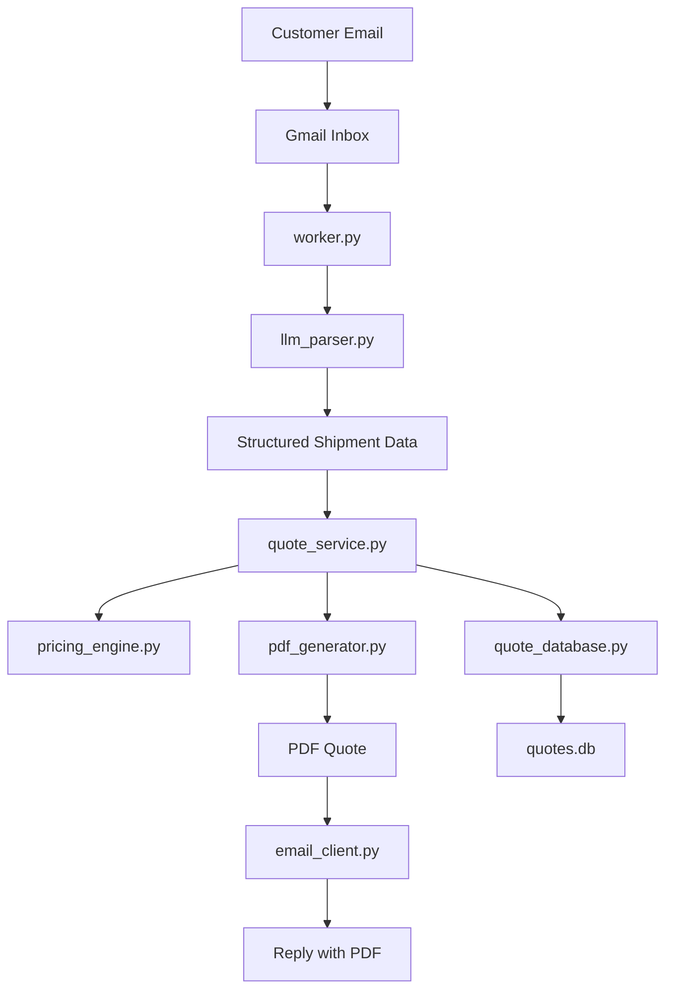

# Cargo Quote Assistant

An email-to-quote automation tool for freight requests.

Cargo Quote Assistant watches a Gmail inbox, detects freight quote requests, extracts shipment details with Gemini, generates a quote, creates a PDF, stores the result in SQLite, and replies to the customer by email.

## Quick Start

### 1. Create and activate a virtual environment

```bash
python3 -m venv .venv
source .venv/bin/activate
python -m pip install --upgrade pip
pip install -r requirements.txt
```

### 2. Add your Gemini API key

Create `.env` in the project root:

```env
GEMINI_API_KEY=your_api_key_here
```

### 3. Add Gmail OAuth credentials

Place your Google OAuth desktop credentials file at:

- [credentials.json](/Users/piyushgaidhani/Desktop/cargo quote assistant/credentials.json)

### 4. Run the agent

```bash
python3 agent_runner.py
```

On first run, a browser window opens for Gmail OAuth. Sign in with the Gmail account the bot should monitor.

### 5. Send a test quote email

Send a quote request from another email account to the Gmail inbox the bot is monitoring, then wait for the next 60-second polling cycle.

## What It Does

The end-to-end workflow is:

1. A customer emails a freight quote request.
2. The worker reads unread Gmail messages.
3. The email is classified as `QUOTE` or `NOT_QUOTE`.
4. Gemini extracts shipment details into structured JSON.
5. The quote engine calculates pricing and accessorials.
6. A PDF quote is generated.
7. The quote is saved in SQLite.
8. The customer receives a reply with the PDF attached.

## Features

- Gmail inbox polling for unread messages
- Freight quote classification
- Shipment extraction with Gemini
- Local quote generation through shared quote logic
- PDF quote generation with ReportLab
- Quote storage in SQLite
- Automatic clarification replies for incomplete shipment requests
- Processed-email tracking to avoid duplicates
- Optional FastAPI quote endpoint

## Architecture Diagram



## Architecture

### Core flow

- [agent_runner.py](/Users/piyushgaidhani/Desktop/cargo quote assistant/agent_runner.py)
  Runs the worker in a loop every 60 seconds.

- [worker.py](/Users/piyushgaidhani/Desktop/cargo quote assistant/worker.py)
  Main orchestration layer. It fetches emails, classifies them, extracts shipments, generates quotes, creates PDFs, saves to the database, and sends replies.

- [llm_parser.py](/Users/piyushgaidhani/Desktop/cargo quote assistant/llm_parser.py)
  Handles email classification and shipment extraction with Gemini.

- [quote_service.py](/Users/piyushgaidhani/Desktop/cargo quote assistant/quote_service.py)
  Shared quote-generation logic used by both the worker and the API.

- [pricing_engine.py](/Users/piyushgaidhani/Desktop/cargo quote assistant/pricing_engine.py)
  Applies distance estimation, pricing rules, equipment selection, and accessorial charges.

### Supporting pieces

- [email_client.py](/Users/piyushgaidhani/Desktop/cargo quote assistant/email_client.py)
  Gmail authentication, inbox reads, reply sending, and marking messages as read.

- [pdf_generator.py](/Users/piyushgaidhani/Desktop/cargo quote assistant/pdf_generator.py)
  Builds one-page freight quote PDFs.

- [quote_database.py](/Users/piyushgaidhani/Desktop/cargo quote assistant/quote_database.py)
  SQLite persistence for generated quotes.

- [query_database.py](/Users/piyushgaidhani/Desktop/cargo quote assistant/query_database.py)
  CLI for inspecting recent quotes and database statistics.

- [last_run_tracker.py](/Users/piyushgaidhani/Desktop/cargo quote assistant/last_run_tracker.py)
  Tracks processed email IDs and last-run metadata.

- [logging_setup.py](/Users/piyushgaidhani/Desktop/cargo quote assistant/logging_setup.py)
  Rotating file logging setup.

- [quote_api.py](/Users/piyushgaidhani/Desktop/cargo quote assistant/quote_api.py)
  Optional FastAPI wrapper around the same shared quote logic.

## Requirements

- Python 3.12 recommended
- A Gmail account for the bot to monitor
- Google OAuth desktop app credentials
- A Gemini API key

Python dependencies are listed in [requirements.txt](/Users/piyushgaidhani/Desktop/cargo quote assistant/requirements.txt).

## Setup

### Python environment

```bash
python3 -m venv .venv
source .venv/bin/activate
python -m pip install --upgrade pip
pip install -r requirements.txt
```

### Environment variables

Create `.env`:

```env
GEMINI_API_KEY=your_api_key_here
```

### Gmail OAuth

Add your desktop OAuth credentials file:

- [credentials.json](/Users/piyushgaidhani/Desktop/cargo quote assistant/credentials.json)

On first successful login, the app will create:

- [token.json](/Users/piyushgaidhani/Desktop/cargo quote assistant/token.json)

If `token.json` becomes stale or revoked, the code falls back to a fresh browser sign-in flow automatically.

## Running the Agent

Start the long-running worker:

```bash
python3 agent_runner.py
```

Each polling cycle does the following:

1. Initializes logging
2. Reads unread Gmail messages
3. Filters likely quote requests
4. Extracts shipment data
5. Generates quotes
6. Creates PDFs
7. Saves to SQLite
8. Replies by email

Current polling interval:

- 60 seconds

## First-Time Gmail Authentication

The first run should:

1. Open a browser window
2. Prompt you to sign in to Gmail
3. Ask for Gmail API access approval
4. Save the resulting OAuth token to `token.json`

If Gmail authentication breaks later, delete `token.json` and rerun:

```bash
rm token.json
python3 agent_runner.py
```

## Workflow Details

### 1. Email retrieval

Unread inbox emails are pulled from Gmail.

The worker currently processes up to 25 unread messages per cycle.

### 2. Email classification

The system first uses heuristics to identify likely freight quote requests.

If the heuristics are ambiguous, Gemini is asked to return:

- `QUOTE`
- `NOT_QUOTE`

Emails classified as non-quote are marked complete so they do not keep resurfacing forever.

### 3. Shipment extraction

For quote-request emails, Gemini is prompted to return structured JSON with:

- origin
- destination
- cargo details
- special services
- pickup date
- notes

The parser also:

- normalizes numeric fields
- defaults missing `pieces` to `1` when weight is present
- retries once with a stricter compact-output prompt if Gemini returns malformed or truncated JSON

### 4. Quote generation

Quote generation happens locally through [quote_service.py](/Users/piyushgaidhani/Desktop/cargo quote assistant/quote_service.py).

The pricing logic includes:

- base rate
- fuel surcharge
- liftgate fee
- climate control fee
- residential delivery fee
- insurance
- other accessorials
- transit days
- equipment selection

### 5. PDF generation

Generated PDFs are written to:

- [quotes](/Users/piyushgaidhani/Desktop/cargo quote assistant/quotes)

Each PDF includes:

- quote ID
- shipment lane
- equipment type
- transit time
- breakdown of charges
- total cost
- quote terms

### 6. Database storage

Quotes are stored in:

- [quotes.db](/Users/piyushgaidhani/Desktop/cargo quote assistant/quotes.db)

Stored data includes:

- quote ID
- customer email and name
- origin and destination
- cargo details
- total cost
- transit time
- quote payload
- PDF path
- original email body

### 7. Reply handling

When quote generation succeeds, the bot replies in-thread with:

- a short lane summary
- total cost
- transit time
- attached PDF

When quote generation cannot proceed because of missing shipment details, the bot sends a clarification email instead.

## Optional API

The worker does not require a separately running HTTP API anymore. It generates quotes directly through shared Python logic.

If you still want an API endpoint, run:

```bash
uvicorn quote_api:app --reload
```

Available endpoint:

- `POST /api/v1/quote`

This endpoint uses the same logic as the worker.

## Test Emails

### Test 1

Subject:

```text
Need freight quote from Dallas to Chicago
```

Body:

```text
Hi,

Please provide a freight quote for 2 pallets of electronics.

Origin:
Dallas, TX 75201

Destination:
Chicago, IL 60601

Shipment details:
- 2 pallets
- Total weight: 1500 lbs
- Dimensions: 48 x 40 x 60 inches each
- Pickup date: next Tuesday
- Liftgate required
- Residential delivery

Thanks,
Test Sender
```

### Test 2

Subject:

```text
Quote request Austin to Miami
```

Body:

```text
Hello,

Can you quote this shipment for me?

Pickup:
Austin, TX 73301

Delivery:
Miami, FL 33101

Cargo:
- 1 skid
- 850 lbs
- Commodity: medical equipment
- Dimensions: 42 x 42 x 50 inches
- Pickup: ASAP

Please send the rate back by email.

Best,
Test Sender
```

## Sample Successful Run

Example terminal output from a successful quote cycle:

```text
INFO:__main__:Starting processing cycle
[LLM] Using Gemini model: gemini-2.5-flash
INFO:quote_database:Quote database initialized.
-----
From: sender@example.com
Subject: Need freight quote from Dallas to Chicago
[LLM] Raw model output: {"origin": {"city": "Dallas", "state": "TX", ...}}
Shipment data: {...}
Quote: {...}
PDF saved to: quotes/QT-20260330-205739-743775.pdf
INFO:quote_database:Quote QT-20260330-205739-743775 saved.
Saved to DB: True
Reply sent with PDF attached.
INFO:__main__:Processing cycle completed
```

## Verifying a Successful Run

You should see terminal output like:

- `Shipment data: {...}`
- `Quote: {...}`
- `PDF saved to: ...`
- `Saved to DB: True`
- `Reply sent with PDF attached.`

Useful verification commands:

See recent quotes:

```bash
python3 query_database.py recent 5
```

See database statistics:

```bash
python3 query_database.py stats
```

Watch logs:

```bash
tail -f logs/agent.log
```

Inspect generated PDFs in:

- [quotes](/Users/piyushgaidhani/Desktop/cargo quote assistant/quotes)

## Distance and Pricing Model

Distance estimation currently uses a layered fallback model:

1. Exact ZIP coordinates for a small built-in ZIP set
2. State centroid fallback when state is known
3. Region fallback based on ZIP prefix
4. Generic fallback when location data is weak

This is useful for testing and internal demos, but it is still approximate. It is not equivalent to a production-grade freight rating engine or a full ZIP centroid dataset.

## Runtime Files

The application creates and updates:

- [token.json](/Users/piyushgaidhani/Desktop/cargo quote assistant/token.json)
  Gmail OAuth tokens

- [last_run.json](/Users/piyushgaidhani/Desktop/cargo quote assistant/last_run.json)
  Last-run metadata and processed email IDs

- [quotes.db](/Users/piyushgaidhani/Desktop/cargo quote assistant/quotes.db)
  SQLite quote database

- [logs/agent.log](/Users/piyushgaidhani/Desktop/cargo quote assistant/logs/agent.log)
  Rotating log output

- [quotes](/Users/piyushgaidhani/Desktop/cargo quote assistant/quotes)
  Generated quote PDFs

## Troubleshooting

### Gmail `invalid_grant`

Cause:

- stale or revoked OAuth token

Fix:

```bash
rm token.json
python3 agent_runner.py
```

### Gemini returns malformed or truncated JSON

Mitigations already in place:

- compact JSON prompt
- larger output token limit
- automatic retry with a stricter prompt

### The agent runs but does nothing

Possible reasons:

- there are no unread emails
- the wrong Gmail account was authorized
- the email was classified as `NOT_QUOTE`

Check:

- the monitored Gmail inbox
- terminal logs
- [logs/agent.log](/Users/piyushgaidhani/Desktop/cargo quote assistant/logs/agent.log)

### Quote request gets a clarification reply instead of a quote

Possible reasons:

- missing shipment details
- malformed model output
- extraction missed ZIP, weight, or pieces

Check for log lines such as:

- `Could not parse JSON`
- `Parsed shipment is invalid`
- `Shipment data: None`

### Gemini deprecation warning

The code currently uses `google.generativeai`, which Google has deprecated.

It still works for now, but the codebase should eventually be migrated to `google.genai`.

## Security Notes

- Do not commit `.env`, `token.json`, or private credential files to public repositories.
- `credentials.json` and `token.json` grant access to Gmail and should be protected.
- Quote data and email bodies may contain customer-sensitive information.

### Recommended `.gitignore`

If you plan to keep this project in Git, add entries like these to `.gitignore`:

```gitignore
.env
.venv/
token.json
__pycache__/
*.pyc
logs/
quotes/
quotes.db
last_run.json
.DS_Store
```

## Current Limitations

- Pricing is approximate
- Relative pickup dates can still be imperfect
- Classification is improved but not perfect
- Shipment extraction depends on LLM output quality
- No carrier API integration
- No dashboard or admin interface
- No formal automated test suite yet

## Recommended Next Improvements

- Migrate from `google.generativeai` to `google.genai`
- Add a proper ZIP centroid dataset or external geocoding source
- Add automated tests for parsing and quote generation
- Add stronger date normalization for relative pickup dates
- Add carrier-specific pricing rules
- Add an internal review dashboard

## Useful Commands

Create and activate virtual environment:

```bash
python3 -m venv .venv
source .venv/bin/activate
```

Install dependencies:

```bash
pip install -r requirements.txt
```

Run the agent:

```bash
python3 agent_runner.py
```

Run the optional API:

```bash
uvicorn quote_api:app --reload
```

Query recent quotes:

```bash
python3 query_database.py recent 5
```

Query database stats:

```bash
python3 query_database.py stats
```

Watch logs:

```bash
tail -f logs/agent.log
```

## Summary

Cargo Quote Assistant is now a working prototype for an email-driven freight quoting workflow.

It can:

- read unread Gmail messages
- detect quote requests
- extract shipment details with Gemini
- generate quotes locally
- create PDFs
- save quotes to SQLite
- reply by email with the quote attached

It is well suited for local testing, demos, and iterative development.
